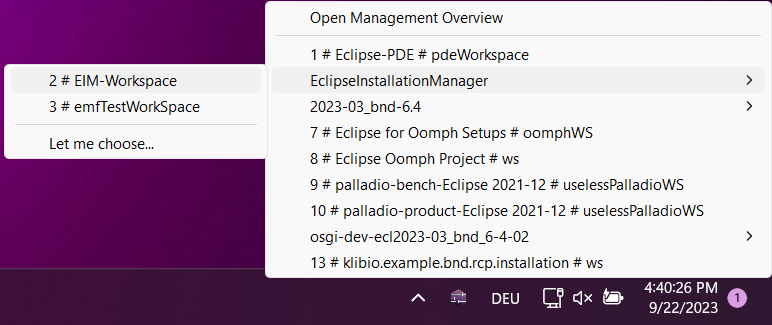
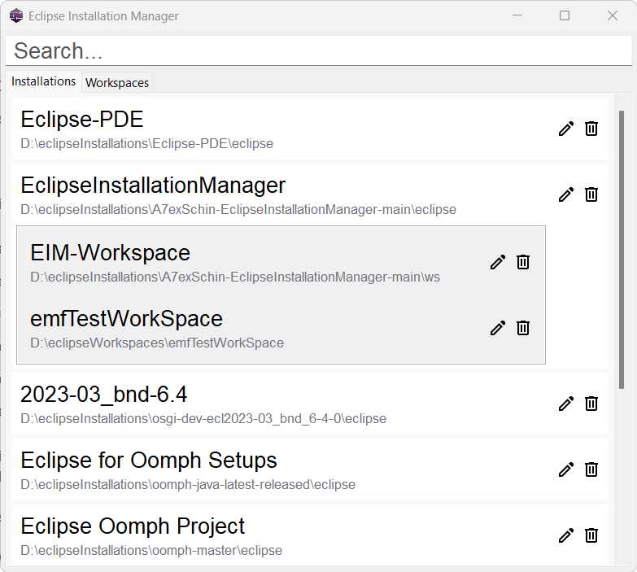

# Eclipse Installation Manager
This application enables a developer to manage all Eclipse Product installations done via the official Eclipse Installer in an easy and convenient way.

Below you can see a screenshot of the tray application and the management view.



## How to run the tray app

Visit the [Releases Page](https://github.com/A7exSchin/EclipseInstallationManager/releases) and download the latest `eim.tray.<platform>.jar` for your platform.

Start the tray application by executing
```
java -jar eim.tray.<platform>.jar
```

For macOS the command differs slightly:

```
java -XstartOnFirstThread -jar eim.tray.cocoa.<arch>_<version>.jar
```

## Current Features

- List all Eclipse installations and workspaces
- Start Eclipse
- Open workspace in Eclipse

Please check out the [Github Discussion](https://github.com/A7exSchin/EclipseInstallationManager/discussions/29) for more information about the current state and future plans.

## Additional packages
Alongside the tray application there are additional packages available:
1. The Eclipse Installation Manager API, which can be implemented yourself.
2. The reference implementation for the Eclipse Installation Manager Service which includes a command line interface. 
