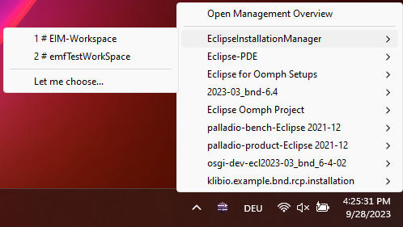
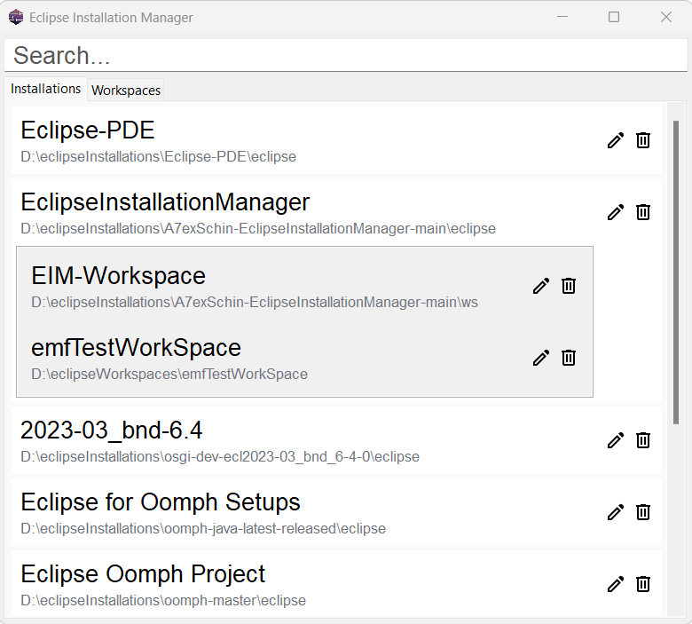
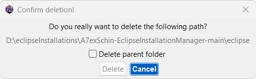
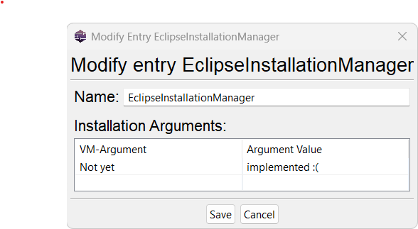

## Table of contents
- **[Eclipse Installation Manager Homepage](https://eim.a7exschin.dev)**
- [Table of contents](#table-of-contents)
- [Prerequisites](#prerequisites)
- [Installation](#installation)
- [Usage and capabilities](#usage-and-capabilities)
- [Screenshots](#screenshots)

## Prerequisites

Eclipse Application installations done with the Eclipse Installer. Alternatively you can add them manually by following the [instructions](https://github.com/A7exSchin/bootPalladio) in the readme of the bootPalladio project.

## Installation

Currently the release is done as a executable java archive. This will change later.
Visit the [Releases Page](https://github.com/A7exSchin/EclipseInstallationManager/releases) and download the latest `eim.tray.<platform>.jar` for your platform.

Start the tray application by executing
```
java -jar eim.tray.<platform>.jar
```

For macOS the command differs slightly:

```
java -XstartOnFirstThread -jar eim.tray.cocoa.<arch>_<version>.jar
```

## Usage and Capabilities

Feature list:
- Easy quick access to all local installations. Simply click on the tray icon and select the installation you want to start, with the assigned workspace.
- List all installations and workspaces and search for them by opening the Management view.
- Change how installations are named within the Eclipse Installation Manager and delete them if they are not needed anymore. Just click the pencil or trash can icon in the Management view.
- Double click to open the Eclipse Installer. If it is not set, the Eclipse Installation Manager will ask you to select the path to the Eclipse Installer.
- Right click the tray icon to open the context menu and configure or quit the application

There are some settings that are saved and that can be changed:

1. Right clicking on the tray icon and selecting `Set Eclipse Installer location` will prompt you to set the path to the Eclipse Installer. This is needed to open the Eclipse Installer from the tray application. If a checkbox appears next to this setting, the path is set.
2. Right clicking on the tray icon and selecting `Allow single entries` will rerender the tray menu and show installations that only have one workspace mapped as a single entry with no submenu. For now, this does not allow to select another workspace. If a checkbox appears next to this setting, single entries are allowed.

Please check out the [Github Discussion](https://github.com/A7exSchin/EclipseInstallationManager/discussions/29) for more information about the current state and future plans.

## Screenshots

<p align="center">
    
</p>
<p align="center">
    
</p>
<p align="left">
    
</p>
<p align="right">
    
</p>

## Additional packages
Alongside the tray application there are additional packages available:
1. The Eclipse Installation Manager API, which can be implemented yourself.
2. The reference implementation for the Eclipse Installation Manager Service which includes a command line interface. 